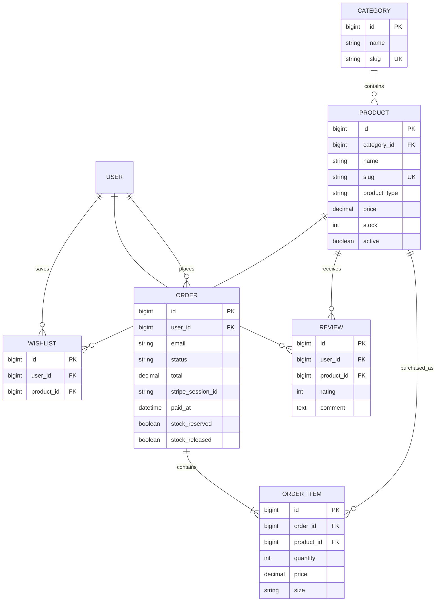

# Entity relationship diagram

```mermaid
erDiagram
    USER ||--o{ WISHLIST : saves
    USER ||--o{ REVIEW : writes
    USER ||--o{ ORDER : places
    CATEGORY ||--o{ PRODUCT : contains
    PRODUCT ||--o{ WISHLIST : saved_as
    PRODUCT ||--o{ REVIEW : receives
    PRODUCT ||--o{ ORDER_ITEM : purchased_as
    ORDER ||--|{ ORDER_ITEM : contains

    CATEGORY {
        bigint id PK
        string name
        string slug UK
    }
    PRODUCT {
        bigint id PK
        bigint category_id FK
        string name
        string slug UK
        string product_type
        decimal price
        int stock
        boolean active
    }
    ORDER {
        bigint id PK
        bigint user_id FK
        string email
        string status
        decimal total
        string stripe_session_id
        datetime paid_at
        boolean stock_reserved
        boolean stock_released
    }
    ORDER_ITEM {
        bigint id PK
        bigint order_id FK
        bigint product_id FK
        int quantity
        decimal price
        string size
    }
    REVIEW {
        bigint id PK
        bigint user_id FK
        bigint product_id FK
        int rating
        text comment
    }
    WISHLIST {
        bigint id PK
        bigint user_id FK
        bigint product_id FK
    }
```
